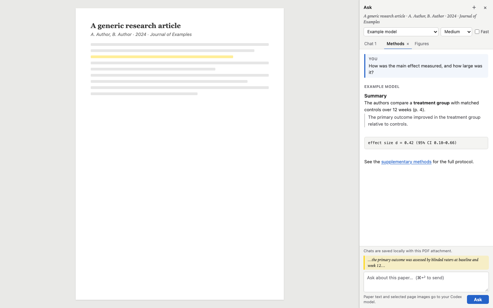

# Zotero Ask

Ask questions about a paper without leaving Zotero’s PDF reader. Zotero Ask adds a compact conversation sidebar, uses the PDF’s extracted text, and selects up to eight page images that are relevant to your question.



*Illustrative interface preview rendered from the current CSS with generic sample content, not captured from Zotero.*

## What it does

- Opens as a sidebar in the Zotero PDF reader.
- Uses the paper text and question-relevant page images, which helps with figures and tables.
- Keeps separate local conversations for each PDF attachment.
- Typesets LaTeX math in questions and answers: `$…$` and `\(…\)` inline, `$$…$$` and `\[…\]` as display equations. Code is left literal, prices such as `$5` stay plain text, and math that cannot be rendered is shown as its source.
- Press Enter to send and Shift+Enter for a new line. Highlight a passage first to focus the question on it.
- Refreshes the model list from Codex whenever the sidebar opens, so newly available models appear automatically.
- Offers model reasoning and Fast settings when the selected model supports them.
- Adds no API key, secret, or separate account. It uses your signed-in Codex CLI.

## Install

### 1. Set up Codex

Install the [Codex CLI](https://github.com/openai/codex#quickstart), run `codex`, and sign in with your ChatGPT account. Confirm that `codex login status` reports a signed-in account.

Zotero Ask talks to the Codex app-server started by the CLI on your computer. It does not contain an API key. You do not need to paste a key into Zotero Ask.

### 2. Install the Zotero plugin

1. Download `zotero-ask-0.1.9.xpi` from the [latest release](https://github.com/benshen94/zotero-ask/releases/latest).
2. In Zotero, choose **Tools → Plugins**.
3. Open the gear menu and choose **Install Plugin From File…**.
4. Select the downloaded XPI and restart Zotero if prompted.
5. Open a PDF and choose **Ask about this PDF** in the reader toolbar.

## Privacy

When you submit a question, Zotero Ask sends the question, PDF metadata, the PDF’s extractable text, and up to eight relevant rendered page images to the Codex CLI running on your computer. Codex then uses the account you signed into. Only ask about documents you are allowed to send to that service.

The plugin does not send data to a Zotero Ask server. It does not include or ask for an API key. Conversations are stored as files in your local Zotero profile and do not modify the PDF or Zotero library records. The Codex process is started with tools and integrations disabled for this document chat.

## Compatibility

| Component | Verified |
| --- | --- |
| Zotero | 9.0.6 |
| Codex CLI | 0.156.1 |
| Platform | macOS |

The installer currently accepts Zotero 9.x. Zotero 10 has not been verified, so the plugin will not claim compatibility with it yet. Model discovery updates with your live Codex catalog; compatibility with future Codex CLI protocol or Zotero changes still depends on testing and may require a plugin update.

## Troubleshooting

- **No models appear:** run `codex login status`, complete sign-in in Codex if needed, then close and reopen Ask.
- **The sidebar does not open:** make sure the open tab is a PDF in Zotero’s reader and Zotero Ask is enabled under **Tools → Plugins**.
- **The plugin is marked incompatible:** check that Zotero is version 9.x and install the latest XPI from Releases.
- **A Codex update breaks Ask:** check the project’s [issues](https://github.com/benshen94/zotero-ask/issues) and install the latest compatible release.

## Build from source

Requires Node.js and Python 3. From the project directory:

```sh
npm ci
npm run check
npm test
./build.sh
```

The XPI is written to `dist/`. Install it through **Tools → Plugins → Install Plugin From File…**.

`npm ci` installs the pinned KaTeX release. `build.sh` copies KaTeX into the XPI and embeds its fonts in the bundled stylesheet, so math rendering never loads anything from the network.

## Development status

Zotero Ask is a small community plugin built on local Zotero extension APIs and the Codex app-server. It is tested against the versions listed above; future upstream changes can require updates. Bug reports and focused pull requests are welcome.

## License

Zotero Ask is released under the [MIT License](LICENSE). The XPI bundles [KaTeX](https://katex.org) 0.18.7 and its fonts, which are also MIT licensed; KaTeX's license ships in the XPI at `vendor/katex/LICENSE`.
